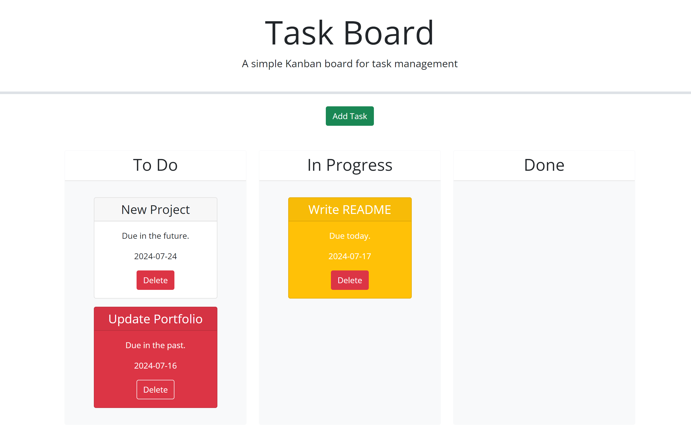

# Third-Party-APIs-Task-Board

## Description

The motivation behind this project was to create a task board where users are able to manage their tasks. The user is able to set due dates for their tasks. When one of the user’s tasks is due that current day then the task card will become yellow, when a task is past due then the card will turn red. When the task is due in a few days then the card will be white and when a task is moved to the done column then the task card will turn white even if it was previously yellow or red. This helps the user to stay organized and keep track of their tasks and when it should be completed. By developing this application I was able to expand my skills with jQuery and I was able to utilize local storage in order to save the tasks. 

## Usage

After the user clicks the add task button then they are able to fill out the input fields for the task title, due date and add a description for their task. After the task gets added then it is saved in local storage. The tasks in local storage then get rendered on the page in the to-do column. The user is then able to drag and drop the task card into the column labeled in progress if the user is working on that task or to the done column if the task has been completed. Based on the due date of the task the color Of the task card will change. If the task is due that day then the task card will be yellow and if the task is past due then the task card will be red.  The user is also able to delete a task by clicking on the delete button and that also removes it from the local storage. 

<a href="https://marlyv1.github.io/third-party-APIs-task-board/">Deployed Application</a>

